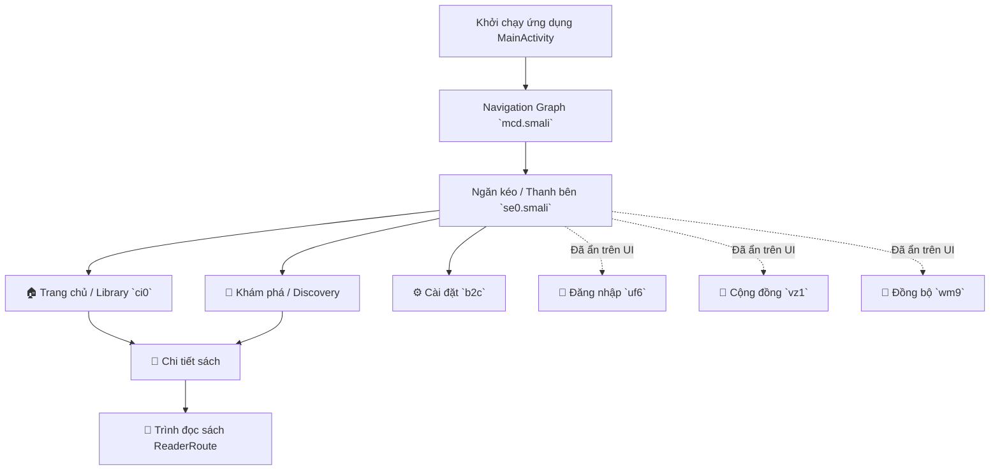

# 🗺️ Bản đồ Kiến trúc Vbook (Code Navigation Map)

Bản đồ này giúp bạn tra cứu nhanh vị trí của các tính năng, giao diện, và logic cốt lõi trong mã nguồn đã được dịch ngược. Dùng nó để biết cần sửa file nào khi muốn thay đổi một tính năng cụ thể.

> 💡 **Quy tắc tìm kiếm (Rule of Thumb):**
> 1. Xem logic / cấu trúc tổng quan bằng cách đọc file Java trong thư mục `jadx_temp/sources/`.
> 2. Chỉnh sửa code thực tế tại file `.smali` tương ứng trong thư mục `vBook_decompiled_nores/smali/`.

---

## 🏗️ 1. Bảng Tra Cứu Nhanh Chức Năng (Quick Lookup Table)

| Tính năng / Thành phần | Vị trí File (Tên lớp) | Chức năng chi tiết |
| --- | --- | --- |
| **🏠 Trang chủ (Tủ sách)** | `ci0`, `gi6` | Giao diện hiển thị các sách đã lưu, sách đang đọc, và quản lý tủ sách cá nhân. |
| **🧭 Khám phá (Discover)** | `i13`, `i03`, `gs6` | State và giao diện màn hình Khám phá, nơi tìm kiếm và duyệt các nguồn sách mới. Các extension/script được nạp tại đây. |
| **⚙️ Cài đặt (Settings)** | `b2c`, `p63` (Admin) | Giao diện cài đặt ứng dụng, tùy chỉnh giao diện, chế độ đọc, và quản trị. |
| **👥 Cộng đồng** | `vz1` | Route và màn hình giao lưu/cộng đồng (đã được ẩn khỏi UI trong ADR-007). |
| **🔐 Đăng nhập / Đăng ký** | `uf6`, `bu9`, `uv6` | Route đăng nhập, đăng ký và xác thực tài khoản (UI đã được ẩn trong ADR-007). |
| **🔄 Đồng bộ (Sync)** | `wm9` | Route đồng bộ hóa dữ liệu cá nhân/tủ sách với server. |
| **💬 Nhắn tin / Thông báo** | `zj7` | Route màn hình tin nhắn và thông báo. |
| **🗂️ Khung Giao Diện (App UI/Drawer)** | `se0`, `mcd`, `uy6` | Chứa giao diện khung của toàn bộ app (Menu Ngăn kéo / Drawer, Header, Avatar, thanh điều hướng dưới). Đây là nơi ẩn/hiện các tab. |
| **🧠 Logic Trạng thái (State/ViewModel)** | `s2c` (UserState), `*ViewModel` | Chứa dữ liệu trạng thái hiện tại (vd: `isLogin`, `userId`). Các file ViewModel quản lý gọi API và xử lý logic nghiệp vụ. |
| **🌐 Mạng / API** | Các lớp dùng thư viện `Ktor` | Tương tác mạng, tải nội dung truyện và sách. |

---

## 🗺️ 2. Biểu đồ Kiến Trúc UI & Navigation (Mermaid)

---

## 🛠️ 3. Hướng dẫn sửa code (Quy trình chuẩn)

1. **Giao diện App (UI Layout):**
   - Hầu hết giao diện dùng Jetpack Compose.
   - Tìm hàm dựng UI Compose, chúng thường biên dịch thành các class nhỏ có chứa nhiều phương thức sinh key mã hóa ngẫu nhiên (ví dụ gọi `uk4.f0(352969239)`).
   - *Ví dụ:* Sửa mục lục thanh menu trái -> Tìm trong `se0.smali` và chỉnh sửa các lời gọi hàm `Lse0;->f` hoặc `Lqxd;->b`.

2. **Logic & Dữ liệu:**
   - Dữ liệu người dùng (Đã đăng nhập hay chưa) được lưu ở `s2c.smali` (UserState).
   - Sửa logic hiển thị bằng cách comment out (bỏ qua) các chỉ thị rẽ nhánh `if-eqz`, `if-nez` trong Smali.

3. **Cài đặt & Các tùy chọn khác:**
   - Tìm các chuỗi (strings) tương ứng trong thư mục resources (`jadx_temp/resources/res/values/strings.xml`) để lấy ID mã Hex của string.
   - Tìm mã Hex đó trong các file `.smali` để biết file nào đang hiển thị màn hình đó.
