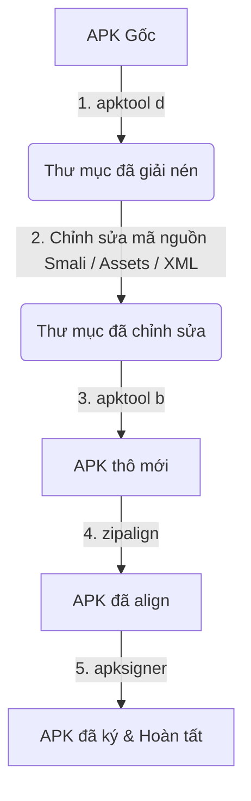

# 🗺️ Architecture Map — Vbook

Bản đồ cấu trúc thư mục và sơ đồ kiến trúc các công cụ của dự án Vbook.

---

## 📂 Directory Structure

```
Vbook/
├── .git/                      # Cấu hình Git của dự án
├── .gitignore                 # Các tệp tin bị Git bỏ qua
├── AGENTS.md                  # Hướng dẫn dành cho các AI Agent (Master Hub)
├── rules.md                   # Quy chuẩn lập trình và ghi chép memory
├── memory/                    # Hệ thống lưu trữ bộ nhớ liên tục (Persistent Memory)
│   ├── episodic/
│   │   ├── decisions-log.md   # Nhật ký lưu trữ quyết định kiến trúc (ADR)
│   │   └── lessons-learned.md # Nhật ký lưu trữ bài học và giải pháp sửa lỗi
│   └── semantic/
│       └── architecture-map.md# Bản đồ kiến trúc dự án (File này)
└── skills/                    # Thư viện kỹ năng chạy script / hướng dẫn công cụ
    └── apk-tools/
        └── SKILL.md           # Hướng dẫn chi tiết kỹ năng dịch ngược và ráp APK
```

---

## 🔄 APK Decompile & Rebuild Lifecycle (Vòng đời Dịch ngược & Ráp APK)

Quy trình hoạt động chuẩn khi làm việc với APK trong dự án này:



Chi tiết từng bước lệnh được cấu hình trong [`skills/apk-tools/SKILL.md`](../skills/apk-tools/SKILL.md).
